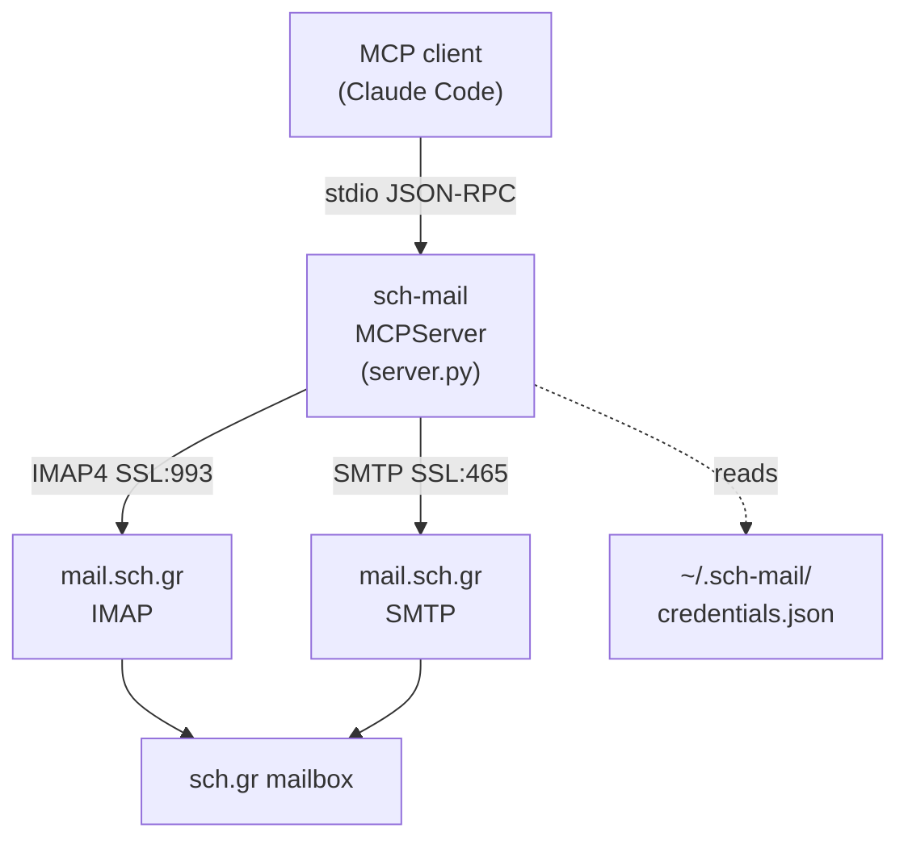

# sch-mail

MCP server for the Greek School Network (`sch.gr`) mailbox: IMAP read + SMTP send, exposed as ten typed tools over the Model Context Protocol.

[](https://github.com/weirdapps/sch-mail/actions/workflows/ci.yml)
[](LICENSE)
[](https://www.python.org/downloads/)

## What it is

A single-file Python MCP server that talks to the `sch.gr` mail servers over IMAP4 (SSL, port 993) and SMTP (SSL, port 465), using the `MCPServer` class from the `mcp[cli]` package (MCP Python SDK 2.x). From inside an MCP client like Claude Code it lets you list folders, read and search mail, download attachments, send new messages, forward existing ones, move messages between folders, and create folders.

Built for the specific quirks of the Greek School Network mailbox: Greek Unicode in subject and sender lines falls back to client-side filtering (IMAP SEARCH on `mail.sch.gr` does not handle non-ASCII reliably), and Drafts / Sent folder discovery walks a candidate list to cope with IMAP namespace variations.

`send_mail` and `forward_mail` default to **draft-first**: the message is IMAP-APPENDed into the Drafts folder with the `\Draft` flag rather than dispatched. Pass `send_now=True` to actually put it on the wire.

> **Deployment policy stays local.** If a particular mailbox should be used more narrowly than the tools allow, write that guidance in `~/.sch-mail/instructions.md` rather than in the code. The server appends the file's text to its MCP instructions at startup (see [Local instructions](#local-instructions-optional)), so every client sees it. The SMTP path works whenever a tool is called with `send_now=True`; keep that in mind before wiring it into any automation.

## Features

Ten MCP tools (six read, four write), all defined in `server.py` and registered via the `@mcp.tool()` decorator on an `MCPServer("sch-mail")` instance. Every tool accepts an optional `account: str` matching a key in the multi-account credentials file (default: the `default` key).

### Read tools

| Tool | Purpose |
|------|---------|
| `sch_list_folders` | List all mailbox folders on the account. |
| `sch_list_mail` | List recent messages in a folder with id (the message's IMAP UID, which every `msg_id` parameter takes), date, from, to, subject, read flag, and attachment indicator. Looks back 30 days unless `since` (`YYYY-MM-DD`) is given; `top` is capped at 100. |
| `sch_get_mail` | Fetch a specific message by id and return headers, attachment metadata, and the body as plain text or HTML (with `max_body_chars` truncation). |
| `sch_search_mail` | Search a folder by keyword across `subject`, `from`, `body`, or `all` fields; auto-fallback to client-side filtering for non-ASCII queries, over a 180-day window unless `since` is given. |
| `sch_download_attachments` | Save attachments from a message to disk (default `~/Downloads`; any `out_dir` must sit inside the [allowed folders](#allowed-folders)), with optional case-insensitive filename filter and collision-safe renaming. |
| `sch_mail_stats` | Quick counts for a folder: total, unread, received today, received in the last 7 days. |

### Write tools

| Tool | Purpose |
|------|---------|
| `sch_send_mail` | Compose and either save as draft (default) or send via SMTP with `send_now=True`. Supports plain / HTML bodies, CC, BCC, and file-path attachments, read only from the [allowed folders](#allowed-folders). Sent messages are archived to the Sent folder via IMAP APPEND. |
| `sch_forward_mail` | Forward an existing message to new recipients, preserving all original attachments verbatim. Same draft-first default as `sch_send_mail`. |
| `sch_move_mail` | Move one message, by UID, between folders: UID MOVE where the server supports it, else UID COPY + `\Deleted` flag + UID EXPUNGE, and a bare EXPUNGE only on a server with neither MOVE nor UIDPLUS. |
| `sch_create_folder` | Create a new mailbox folder and optionally subscribe to it. Idempotent: returns `already_exists` if the folder is already there. |

## Architecture



The server opens a fresh IMAP or SMTP connection per tool call and closes it in a `finally` block. There is no connection pooling and no long-lived session.

## Installation

Requires Python 3.12+. The repo ships a `uv.lock` for reproducible installs via [uv](https://github.com/astral-sh/uv), but plain `pip` works too.

```bash
# HTTPS (no SSH key required):
git clone https://github.com/weirdapps/sch-mail.git
# or, with SSH:
git clone git@github.com:weirdapps/sch-mail.git
cd sch-mail

# Option A: uv (recommended, matches the committed lockfile)
uv sync

# Option B: pip
python -m venv .venv
.venv/bin/pip install -e .
```

The only runtime dependency is `mcp[cli]` (constraint declared in `pyproject.toml`, currently `>=2.0.0`, pinned by `uv.lock`). The optional `dev` extra adds `ruff` and `pytest`, which is what CI lints and tests with.

## Configuration

Credentials live at `~/.sch-mail/credentials.json`, outside the repo. `credentials.json` is also in `.gitignore` for safety.

Single-account format:

```json
{
  "email": "user@sch.gr",
  "password": "..."
}
```

Multi-account format (referenced from every tool via the `account` argument):

```json
{
  "accounts": {
    "personal": { "email": "user@sch.gr",       "password": "..." },
    "work":     { "email": "other.user@sch.gr", "password": "..." }
  },
  "default": "personal"
}
```

The key names are yours to choose. A tool called without `account` uses the account `default` names, or the first one listed when there is no `default`.

Connection parameters are hard-coded in `server.py`:

| Constant | Value |
|----------|-------|
| `IMAP_HOST` | `mail.sch.gr` |
| `IMAP_PORT` | `993` (SSL) |
| `SMTP_HOST` | `mail.sch.gr` |
| `SMTP_PORT` | `465` (SSL) |
| `CRED_PATH` | `~/.sch-mail/credentials.json` |
| `INSTRUCTIONS_PATH` | `~/.sch-mail/instructions.md` (optional) |
| `DEFAULT_DOWNLOAD_DIR` | `~/Downloads` |

### Local instructions (optional)

When `~/.sch-mail/instructions.md` exists, the server reads it once at startup and appends its text, after a single space, to the built-in MCP instructions that every client receives. Use it for anything specific to one deployment, such as house rules for how a mailbox may be used, so that none of it has to live in this repo. A missing or blank file leaves the built-in text alone; a file that cannot be read or decoded as UTF-8 stops the server from starting rather than letting it run without the guidance.

### Allowed folders

`sch_send_mail` reads attachments, and `sch_download_attachments` saves files, only inside an allowlist of folders. Every tool argument is chosen by a model that is also reading mail anyone can send, so without the limit a hostile message could get a private key or document attached to a draft, or a file saved somewhere that runs it. Paths are resolved with symlinks followed before the check, so neither `..` nor a link inside an allowed folder can point out of it. Hidden files and folders below an allowed folder are refused too, because other programs load files from them without asking (a `.venv`'s `site-packages`, `.git/hooks`, editor and agent settings); to use a hidden folder anyway, name that folder itself in `SCH_MAIL_ALLOWED_DIRS`. The defaults are deliberately narrow:

- `~/Downloads`
- the system temp dir, and `/tmp`

`~/Documents`, `~/Desktop` and cloud-synced folders are not among them. To attach a file kept elsewhere, copy it into `~/Downloads` first, or name its folder in `SCH_MAIL_ALLOWED_DIRS`.

`SCH_MAIL_ALLOWED_DIRS` replaces the defaults outright: absolute paths separated by `os.pathsep` (`:` on macOS and Linux). `~` is expanded and relative entries are ignored. It is the only setting the server takes from the environment. A refused path is reported as an error that names the variable. An attachment that is refused, missing or not a regular file fails the whole call, so a message never goes out quietly missing a file. Saved file names are cleaned too: path separators, control characters and bidirectional-override characters become `_`, and a leading dot gets a `_` prefix so nothing lands hidden.

## Usage

### Run the server

```bash
bash run_mcp.sh
```

`run_mcp.sh` resolves its own directory and execs `.venv/bin/python -m server`, so it works from any working directory.

### Register with Claude Code

Add an entry to your Claude Code MCP config pointing at the launcher script:

```json
{
  "mcpServers": {
    "sch-mail": {
      "command": "/absolute/path/to/sch-mail/run_mcp.sh"
    }
  }
}
```

Claude Code starts the server on demand over stdio; you do not run it manually.

### Example tool calls

Once the server is registered, tools are available as `sch_list_mail`, `sch_send_mail`, and so on. Concrete examples:

- **Triage the inbox**: `sch_list_mail(folder="INBOX", top=20)` returns the 20 most recent messages with read / attachment flags.
- **Read a message**: `sch_get_mail(msg_id="12345", body="text", max_body_chars=5000)`.
- **Search for a topic in Greek**: `sch_search_mail(query="Επιμόρφωση", field="subject", top=10)` (auto-uses client-side filtering because of non-ASCII).
- **Save a draft** (default behaviour): `sch_send_mail(to="foo@sch.gr", subject="test", body="hello")` returns `{"status": "draft_saved", "folder": "Drafts", ...}`. Review it in `sch.gr` webmail and hit send, or rerun with `send_now=True`.
- **Dispatch immediately**: same call with `send_now=True` sends via SMTP and archives to the Sent folder via IMAP APPEND. There is no undo.
- **Forward preserving attachments**: `sch_forward_mail(msg_id="12345", to="bar@sch.gr", additional_text="FYI")`.
- **Move a message**: `sch_move_mail(msg_id="12345", dest_folder="INBOX/Archive2026")`. The destination must exist; use `sch_create_folder("INBOX/Archive2026")` first if it does not.

## Development

The project follows the house Python conventions used across `weirdapps` repos.

```bash
# Install the dev extra first: a plain `uv sync` does not pull ruff in,
# because ruff lives in the optional `dev` extra, not the default deps.
uv sync --extra dev --frozen

# Lint + format (config in pyproject.toml)
uv run ruff check .
uv run ruff format --check .

# Import sanity check, then the test suite (offline: tests/conftest.py
# blocks real sockets and the real credentials file)
uv run python -c "import server; print('Import OK')"
uv run pytest -q
```

`.pre-commit-config.yaml` wires up `ruff`, `ruff-format`, `gitleaks` secret scanning, and the standard `pre-commit-hooks` hygiene set. Install once with `pip install pre-commit && pre-commit install`.

CI (`.github/workflows/ci.yml`) runs two jobs on push and PR to `master`: `lint` (`ruff check` plus `ruff format --check`) and `test` (the `import server` smoke check, then `pytest -q`). Both install with `uv sync --frozen`, so `uv.lock` has to stay in step with `pyproject.toml` or CI fails before it runs anything. SonarCloud analysis is wired via `sonar-project.properties` (project key `weirdapps_sch-mail`).

Dependabot runs weekly against two ecosystems, `uv` and `github-actions`, with minor and patch updates grouped (see `.github/dependabot.yml`). `.github/workflows/dependabot-auto-merge.yml` is a thin caller for the shared reusable workflow `weirdapps/shared-workflows/.github/workflows/dependabot-auto-merge.yml`, pinned to a commit SHA; it merges a Dependabot PR once that PR's own checks are green and leaves majors open for review.

## Security

Report vulnerabilities privately through GitHub (the **Security** tab, then **Report a vulnerability**); see `SECURITY.md`. Credentials never enter the repo: `credentials.json` and `*.env` are in `.gitignore`, and `gitleaks` runs pre-commit.

## Related projects

[`weirdapps/yahoo-access`](https://github.com/weirdapps/yahoo-access) is a downstream adaptation of this server (a copy rather than a GitHub fork, so there is no upstream PR relationship), retargeted at Yahoo Mail's IMAP / SMTP endpoints and its own multi-account setup.

## License

MIT, see [`LICENSE`](LICENSE). Copyright (c) 2026 Dimitrios Plessas.
